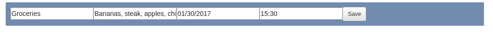

# To-Do List App

## Description

This is a simple to-do list app that allows the user to create, edit, and delete tasks. It also allows the user to add tags to each task to be more organized.

## Instructions

### Add Task

- Find and click on the "Add Task" button to open up the fields to add tasks
- Users can add a title, description, and completion date/time

- Optionally, tags can be added alongside each task for more organization

- When completed with all the task details, just press the "Submit" button and the newly created task shows up below!

### Sort Task

- You can sort tasks by clicking on any of the tag buttons

### Remove/Edit Task

- You can remove/edit tasks by clicking on the the task and finding the row of buttons labeled "Remove" and "Edit"

- To edit, click the "Edit" button and a field similar to the add task should show up
- Press the "Save" button to save any new changes

## Code 

### Languages/Libraries

- JavaScript
- jQuery
- HTML
- CSS
- Bootstrap

### js Folder

  #### controllers - Changes what the user sees based on user interactions
  
    - add_task.js
    - edit_task.js
    - remove_task.js
    - sort_task.js
  
  #### models - Contains data for initial and newly created tasks/tags
  
    - create_tag.js
    - create_task.js
